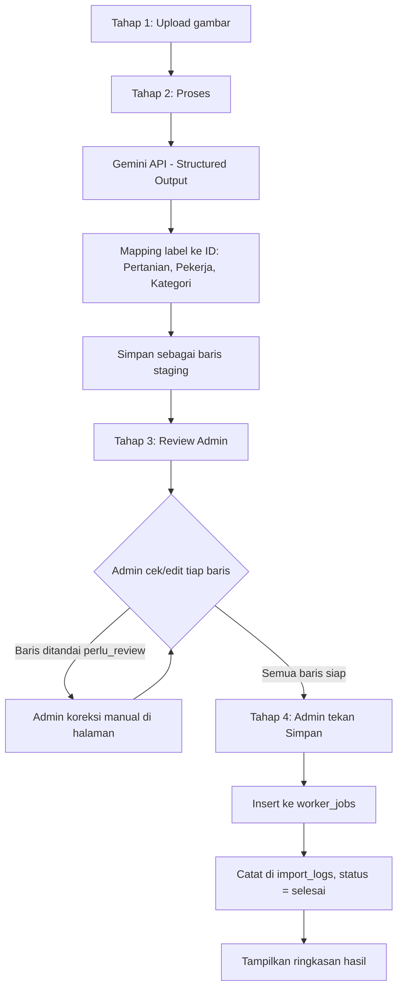

# PRD: Modul Import Otomatis Catatan Pekerjaan dari Foto Buku Tulis

**Produk:** Pengen Tani (pengentani.my.id)
**Modul:** Halaman Import Pekerjaan & Upah dari Foto Buku Catatan Manual
**Stack terkait:** Laravel 13, Gemini API, Antigravity (dev environment)
**Status:** Draft untuk pengembangan

---

## 1. Latar Belakang

Pekerja lapangan (mis. Cak Khusnul) mencatat pekerjaan harian (penyiraman, spraying, pasang lanjaran, dll) dan upahnya secara manual di buku tulis, dengan istilah/singkatan lokal (SPL, M.Jum, JJ6, Ngocor, Ngobat, dll). Saat ini data ini dipindahkan manual ke modul **Pencatatan Pekerjaan & Upah** di Pengen Tani, satu per satu lewat form dropdown (Pertanian, Pekerja, Kategori Pekerjaan, Status).

Proses manual ini lambat dan rawan salah ketik. Percobaan memindahkan lewat Excel gagal karena kolom-kolom kunci di sistem (Pertanian, Pekerja, Kategori Pekerjaan) adalah **relasi ke ID record**, bukan teks bebas — sehingga copy-paste teks dari Excel tidak bisa langsung dipetakan ke pilihan dropdown yang benar.

Modul ini dibangun sebagai **halaman tersendiri di aplikasi** (bukan sekadar command CLI di belakang layar), dengan alur linear: **Upload gambar → Proses → Review Admin → Insert**.

## 2. Tujuan

- Memotong waktu input data dari buku catatan → sistem, dari manual per-baris menjadi satu kali unggah foto di satu halaman.
- Menghilangkan kesalahan pemetaan dropdown (Pertanian/Pekerja/Kategori/Status) dengan resolusi otomatis ke ID yang benar, tapi tetap bisa dikoreksi manual sebelum disimpan.
- Menjaga akurasi data finansial (upah, konsumsi) dengan langkah review wajib sebelum data masuk ke tabel produksi.
- Membuat proses ini dapat diulang untuk pekerja lain dan buku catatan berikutnya, bukan solusi sekali pakai.

## 3. Ruang Lingkup

**Masuk cakupan (in-scope):**

- Halaman baru di aplikasi (mis. `/console/import-foto-pekerjaan`) dengan 4 tahap: Upload → Proses → Review Admin → Insert.
- Ekstraksi data terstruktur dari 1–2 foto halaman buku catatan per proses.
- Pemetaan label mentah (SPL, M.Jum, JJ6, Ngocor, Ngobat, dst) ke ID record asli di database.
- Tabel staging yang menyimpan hasil ekstraksi sementara, bisa diedit admin sebelum di-commit.
- Insert final ke tabel `worker_jobs` (atau nama tabel setara) dipicu tombol di halaman review — bukan lewat browser automation UI dropdown.
- Log import untuk mencegah foto yang sama diproses dua kali.

**Di luar cakupan (out-of-scope) untuk versi awal:**

- OCR real-time dari kamera (tetap berbasis upload foto, bukan live capture).
- Pembuatan otomatis record Pertanian/Pekerja/Kategori baru tanpa konfirmasi manusia (sistem hanya *mencocokkan* ke data yang sudah ada).
- Integrasi notifikasi WhatsApp/Telegram (dicatat sebagai fase lanjutan opsional).

## 4. Aktor

| Aktor | Peran |
| --- | --- |
| Nams (Admin/Owner) | Mengunggah foto di halaman, mereview & mengedit entri hasil ekstraksi, menekan tombol simpan final |
| Gemini API | Membaca foto, mengembalikan data terstruktur (JSON) |
| Backend Laravel (Service + Controller) | Memetakan data ke ID, menyimpan staging, insert final ke database |
| Sistem Pengen Tani (Laravel) | Penyimpan data final, sumber kebenaran untuk daftar Pertanian/Pekerja/Kategori |

## 5. Alur Proses (4 Tahap)



Status halaman mengikuti status `import_logs.status`: `diproses` (tahap 1–2 berjalan) → `menunggu_review` (tahap 3, admin bisa membuka halaman kapan saja untuk lanjut) → `selesai` (tahap 4 sudah di-commit) / `gagal` (Gemini API error atau proses ekstraksi gagal total, admin bisa coba ulang).

## 6. Spesifikasi Halaman (UI)

**Route usulan:** `/console/import-foto-pekerjaan` (atau submenu dari menu "Pencatatan Pekerjaan & Upah" yang sudah ada)

Sesi review **boleh ditinggal dan dilanjutkan nanti** — admin tidak harus menyelesaikan Tahap 3 dalam satu kali duduk. Karena itu halaman ini punya dua bagian:

### Tahap 0 — Daftar Sesi Import

- Landing page modul ini menampilkan daftar sesi import (dari `import_logs`), dengan kolom: tanggal upload, nama file, status (`diproses` / `menunggu_review` / `selesai` / `gagal`), jumlah baris, jumlah baris perlu review.
- Sesi berstatus `menunggu_review` bisa diklik untuk langsung masuk ke Tahap 3 dengan seluruh baris staging sebelumnya masih tersimpan persis seperti saat ditinggal.
- Tombol "Import Foto Baru" untuk memulai sesi baru (Tahap 1).

### Tahap 1 — Upload gambar atau Tempel JSON

Ada dua jalur masuk data di tahap ini, dipilih lewat tab/toggle di halaman:

**Jalur A — Upload gambar (otomatis)**

- Area drag-and-drop / pilih file, menerima 1–2 gambar (jpg/png) sekaligus.
- Preview thumbnail sebelum dikirim.
- Tombol "Proses Foto Ini" → lanjut ke Tahap 2, foto dikirim ke Gemini API di backend.

**Jalur B — Tempel JSON (manual, dari chat AI apa pun)**

- Untuk kondisi kuota Gemini API habis, atau admin ingin memverifikasi hasil bacaan dulu lewat chat (Claude/Gemini/ChatGPT) sebelum masuk sistem.
- Admin memfoto buku catatan, menempelkannya ke chat AI pilihannya bersama **prompt ketat** (lihat Lampiran), lalu menyalin hasil JSON yang dikeluarkan AI tersebut.
- Halaman menyediakan kotak teks besar (textarea) untuk menempel JSON tersebut apa adanya.
- Tombol "Validasi & Proses" → sistem memvalidasi struktur JSON (lihat FR1b) → jika valid, lanjut langsung ke langkah mapping (skip pemanggilan Gemini API di backend, karena ekstraksi sudah dilakukan manual).
- Jika JSON tidak valid (field hilang, tipe data salah, enum di luar daftar), tampilkan pesan error yang jelas per field, dan JANGAN lanjut ke mapping.

### Tahap 2 — Proses

- Setelah tombol ditekan, halaman menampilkan status loading ("Membaca foto...", "Mencocokkan data...").
- Di belakang layar: foto dikirim ke Gemini API → hasil dipetakan ke ID via tabel mapping → disimpan sebagai baris-baris staging (belum masuk `worker_jobs`).
- Bila gagal (mis. Gemini API error/timeout), tampilkan pesan error dan tombol "Coba Lagi", `import_logs.status` diset `gagal`.

### Tahap 3 — Review Admin

- Menampilkan tabel hasil ekstraksi, satu baris per entri pekerjaan, dengan kolom yang **sama seperti form pekerjaan yang sudah ada**: Tanggal, Pertanian (dropdown, sudah ter-pre-select dari mapping), Pekerja (dropdown, pre-select), Kategori Pekerjaan (dropdown, pre-select), Deskripsi (teks, bisa diedit), Upah (Rp), Konsumsi (Rp), checkbox "Sertakan baris ini".
- Baris dengan `confidence_rendah = true` atau tanpa hasil mapping otomatis, ditandai visual (mis. warna kuning/ikon peringatan) dan **wajib disentuh** (dropdown dipilih manual) oleh admin sebelum bisa lanjut ke Tahap 4.
- Admin bisa menghapus/menonaktifkan baris yang salah baca total (mis. bukan entri kerja, atau duplikat).
- Ringkasan berjalan di bagian bawah: jumlah baris siap, jumlah baris masih perlu perhatian, total upah, total konsumsi — mirip footer "Total Upah / Total Konsumsi" yang sudah ada di halaman utama.

### Tahap 4 — Insert

- Tombol "Simpan ke Sistem" aktif hanya jika tidak ada baris berstatus "perlu review" yang belum dikonfirmasi.
- Setelah ditekan: seluruh baris staging yang tercentang "Sertakan" di-insert ke `worker_jobs` dalam satu transaction.
- Setelah sukses: tampilkan ringkasan hasil (jumlah baris masuk, total nominal) dan tautan ke halaman "Pencatatan Pekerjaan & Upah" untuk verifikasi langsung.

## 7. Kebutuhan Fungsional

### FR1 — Ekstraksi terstruktur (dua jalur)

**FR1a — Otomatis via Gemini API**

- Sistem mengirim foto ke Gemini API dengan `responseSchema` (structured output), bukan prompt teks bebas.
- Field `kebun_kode` dan `kategori` dibatasi dengan `enum` sesuai daftar yang sudah dikenal sistem, untuk mencegah Gemini mengarang label baru.
- Setiap entri hasil ekstraksi memiliki flag `confidence_rendah` (boolean) yang diisi Gemini bila tulisan sulit dibaca/ambigu.

**FR1b — Manual via tempel JSON**

- Admin dapat melewati pemanggilan Gemini API di backend dengan menempelkan JSON yang sudah dihasilkan sendiri dari chat AI mana pun (Claude, Gemini, ChatGPT), menggunakan prompt ketat yang disediakan sistem (lihat Lampiran).
- JSON yang ditempel divalidasi ketat terhadap skema yang sama dengan FR1a (lihat Bagian 9) sebelum diteruskan ke langkah mapping — field wajib, tipe data, dan nilai enum dicek satu per satu.
- JSON yang gagal validasi ditolak dengan pesan error spesifik per field (bukan pesan generik), dan sesi tidak lanjut ke Tahap 3 sampai admin memperbaiki/menempel ulang.
- Baik Jalur A maupun Jalur B bermuara ke proses yang sama persis di FR2 (mapping) dan seterusnya — tidak ada percabangan logika setelah data terstruktur didapat.

### FR2 — Tabel mapping referensi

- Disediakan tabel/konfigurasi mapping yang memetakan:
  - Kode kebun → UUID Pertanian (mis. `SPL` → UUID *Kebun Wonorejo - Cabai Apr 26-Mar 27*)
  - Nama kategori mentah → UUID/enum Kategori Pekerjaan (mis. `Ngocor` → `Penyiraman`)
  - Nama pekerja di catatan → UUID Pekerja (mis. `Kusnul`/`Cak Kusnul` → *Cak Khusnul*)
- Mapping ini dapat ditambah/diedit tanpa mengubah kode program (data-driven, bukan hardcoded di script).

### FR3 — Staging & review di halaman

- Hasil ekstraksi + mapping disimpan sebagai baris staging (`import_staging_rows`), terhubung ke satu `import_logs`, **bukan langsung** masuk `worker_jobs`.
- Halaman review menampilkan seluruh baris staging milik satu sesi import, dengan field yang dapat diedit sebelum commit.
- Baris `confidence_rendah = true` atau tanpa padanan mapping tidak boleh ikut ter-insert sebelum disentuh/dikonfirmasi admin di UI.

### FR4 — Insert final dipicu tombol admin

- Endpoint internal (dipanggil tombol "Simpan ke Sistem") menerima ID sesi import, membaca seluruh baris staging yang tercentang "Sertakan" dan sudah lolos validasi, lalu memanggil model Eloquent `worker_jobs` untuk tiap baris.
- Proses berjalan dalam DB transaction — jika satu baris gagal, seluruh batch tidak ter-commit sebagian.
- Setelah sukses, `import_logs.status` diset `selesai` dan baris staging ditandai sudah diproses (tidak dihapus, untuk jejak audit).

### FR5 — Idempotency / log import

- Setiap foto yang diproses dicatat (nama file/hash, tanggal proses, jumlah baris masuk) di tabel `import_logs`.
- Sistem memperingatkan jika foto dengan hash yang sama diunggah ulang.

### FR6 — Ringkasan hasil

- Setelah Tahap 4 selesai, halaman menampilkan ringkasan: jumlah baris berhasil, total upah, total konsumsi.
- (Opsional/fase lanjutan) ringkasan dikirim via WhatsApp/Telegram.

### FR7 — Sesi review dapat ditinggal dan dilanjutkan

- Baris staging (`import_staging_rows`) dan status sesi (`import_logs.status = menunggu_review`) tetap tersimpan di database selama belum ditekan "Simpan ke Sistem" — tidak bergantung pada state sementara di browser (bukan disimpan di local storage/session saja).
- Admin dapat menutup halaman kapan saja di Tahap 3 tanpa kehilangan progres koreksi yang sudah dilakukan.
- Tahap 0 (Daftar Sesi Import) menjadi titik masuk untuk melanjutkan sesi yang tertunda, sehingga admin tidak perlu mengingat-ingat atau mengunggah ulang foto yang sama.

## 8. Model Data (usulan)

**`import_logs`**

| Kolom | Tipe | Keterangan |
| --- | --- | --- |
| id | uuid |  |
| file_hash | string | untuk deteksi duplikat |
| file_name | string |  |
| pekerja_id | uuid, nullable | pekerja dominan di foto ini |
| status | enum(`diproses`,`menunggu_review`,`selesai`,`gagal`) | mengikuti tahap di halaman |
| total_baris | integer |  |
| baris_perlu_review | integer |  |
| created_at / updated_at | timestamp |  |

**`import_staging_rows`** (baris hasil ekstraksi, sebelum masuk `worker_jobs`)

| Kolom | Tipe | Keterangan |
| --- | --- | --- |
| id | uuid |  |
| import_log_id | uuid (FK) |  |
| tanggal | date |  |
| pertanian_id | uuid, nullable | hasil mapping, bisa diisi manual di UI |
| pekerja_id | uuid, nullable |  |
| kategori | string, nullable |  |
| deskripsi | text, nullable |  |
| upah | integer |  |
| konsumsi | integer |  |
| status_baris | enum(`ok`,`perlu_review`,`diabaikan`) |  |
| confidence_rendah | boolean | dari Gemini |
| disertakan | boolean, default true | dicentang/tidak di UI review |

**`import_mappings`** (referensi label mentah → ID)

| Kolom | Tipe | Keterangan |
| --- | --- | --- |
| id | uuid |  |
| tipe | enum(`pertanian`,`pekerja`,`kategori`) |  |
| label_mentah | string | mis. `SPL`, `Ngocor`, `Kusnul` |
| target_id | uuid/string | ID atau enum tujuan di tabel aslinya |
| aktif | boolean | untuk menonaktifkan mapping lama tanpa hapus |

## 9. Skema Data Terstruktur

Skema ini dipakai untuk **dua jalur sekaligus**: sebagai `responseSchema` pemanggilan Gemini API (Jalur A, otomatis), dan sebagai acuan validasi JSON yang ditempel manual (Jalur B). Keduanya harus menghasilkan struktur data yang identik, supaya langkah mapping & staging setelahnya tidak perlu tahu dari jalur mana data itu berasal.

```json
{
  "type": "OBJECT",
  "properties": {
    "entries": {
      "type": "ARRAY",
      "items": {
        "type": "OBJECT",
        "properties": {
          "tanggal": {"type": "STRING", "description": "Format YYYY-MM-DD"},
          "kebun_kode": {"type": "STRING", "enum": ["SPL", "MJUM", "JJ6"]},
          "kategori": {"type": "STRING", "enum": ["Penyiraman", "Spraying", "Pasang Lanjaran", "Menyulam"]},
          "deskripsi": {"type": "STRING"},
          "upah": {"type": "INTEGER"},
          "konsumsi": {"type": "INTEGER"},
          "confidence_rendah": {"type": "BOOLEAN"}
        },
        "required": ["tanggal", "kebun_kode", "kategori", "upah"]
      }
    }
  }
}
```

Enum `kebun_kode` dan `kategori` di atas perlu disinkronkan dengan isi tabel `import_mappings` — bila ada kebun/kategori baru, keduanya harus diperbarui bersamaan (termasuk teks prompt di Lampiran).

## 10. Penanganan Error & Edge Case

| Kasus | Penanganan |
| --- | --- |
| Label kebun/kategori tidak dikenal (di luar enum) | Ditolak Gemini secara struktural (enum-constrained); jika tetap muncul di deskripsi bebas, baris masuk `status_baris = perlu_review` |
| Tanggal tidak terbaca / rusak tulisannya | `confidence_rendah = true`, baris ditahan di Tahap 3 sampai dikoreksi admin |
| Satu tanggal punya lebih dari satu entri kerja | Ditangani sebagai baris staging terpisah, bukan digabung |
| Foto sama diunggah dua kali | Dicegah lewat `file_hash` di `import_logs` |
| Nominal konsumsi tidak tertulis per baris (hanya total bulanan di buku) | Diatur lewat aturan bisnis eksplisit (mis. flat Rp10.000/hari, dibagi rata jika lebih dari satu entri per hari) — bukan ditebak Gemini |
| Admin ingin membatalkan satu baris tanpa membatalkan seluruh import | Uncheck "Sertakan" di Tahap 3, baris tetap tersimpan di staging dengan `disertakan = false` untuk jejak, tapi tidak ikut ter-insert |
| Proses insert gagal di tengah jalan (Tahap 4) | Seluruh batch di-rollback (DB transaction), status kembali `menunggu_review` |
| Gemini API gagal/timeout di Tahap 2 | `import_logs.status = gagal`, admin bisa tekan "Coba Lagi" tanpa upload ulang foto, atau beralih ke Jalur B (tempel JSON manual) |
| JSON hasil tempel manual (Jalur B) tidak valid — field hilang, tipe salah, atau nilai enum di luar daftar | Ditolak sebelum masuk mapping; error ditampilkan per field (mis. "baris ke-4: `kebun_kode` harus salah satu dari SPL/MJUM/JJ6"), sesi tetap di Tahap 1 sampai diperbaiki |
| JSON hasil tempel dibungkus markdown fence (`json ... `) oleh chat AI yang dipakai admin | Sistem melakukan strip/parsing toleran terhadap fence umum sebelum validasi ketat, supaya admin tidak perlu edit manual |

## 11. Kebutuhan Non-Fungsional

- **Keamanan:** halaman & endpoint hanya bisa diakses Admin terautentikasi; API key Gemini disimpan di `.env`, tidak pernah di-commit ke repo.
- **Auditability:** setiap baris yang masuk ke `worker_jobs` lewat jalur ini idealnya punya penanda sumber (mis. `sumber = 'import_foto'`) agar bisa dibedakan dari input manual saat audit; baris staging tidak dihapus setelah selesai, sebagai jejak apa yang dikoreksi admin.
- **Biaya:** volume foto per bulan kecil (puluhan baris), jadi diperkirakan tetap dalam free tier Gemini API — perlu dipantau kalau skala bertambah (misal menambah banyak pekerja lain).

## 12. Metrik Keberhasilan

- % baris yang otomatis lolos ke status `ok` tanpa perlu koreksi manual di Tahap 3 (target awal: fleksibel, dipakai untuk melihat tren, bukan patokan kaku di versi pertama).
- Waktu total dari upload foto sampai data tersimpan di sistem, dibanding proses manual saat ini.
- Nol kesalahan mapping ke dropdown yang salah (Pertanian/Pekerja/Kategori) pada data yang sudah berstatus `selesai`.

## 13. Pertanyaan Terbuka

- Apakah `import_mappings` perlu UI admin sendiri di Pengen Tani, atau cukup dikelola lewat seeder/tinker untuk saat ini?
- Apakah status "Terbayar/Belum Bayar" ditentukan otomatis dari isi buku catatan, atau selalu default dan dikonfirmasi manual per batch di Tahap 3?
- Perlukah foto asli disimpan sebagai lampiran/bukti pada `import_logs` untuk keperluan audit di kemudian hari?
- Apakah sesi berstatus `menunggu_review` yang dibiarkan terlalu lama (mis. berbulan-bulan) perlu mekanisme pengingat atau pembersihan otomatis, atau dibiarkan menumpuk selama masih relevan?

## 14. Lampiran: Prompt Ketat untuk Jalur B (Tempel JSON Manual)

Prompt ini ditampilkan di halaman (tombol "Salin Prompt") persis di sebelah kotak upload Jalur B, supaya admin tinggal salin-tempel ke Claude/Gemini/ChatGPT bersama foto buku catatan. Enum di dalamnya **wajib disinkronkan manual** setiap kali tabel `import_mappings` berubah.

```
Anda adalah sistem ekstraksi data yang sangat presisi. Baca foto buku catatan tulisan tangan yang saya lampirkan, lalu ubah menjadi JSON terstruktur.

ATURAN WAJIB — TIDAK BOLEH DILANGGAR:
1. Baca setiap baris tulisan tangan secara berurutan dari atas ke bawah. Jangan lompati satu baris pun yang berisi entri kerja (baris "libur"/kosong tidak perlu dimasukkan).
2. Jika satu tanggal punya lebih dari satu entri kerja (misal pagi dan sore), buat OBJECT terpisah untuk tiap entri di dalam array "entries".
3. Keluarkan HANYA JSON valid dengan struktur PERSIS seperti ini, tanpa teks lain sebelum atau sesudahnya, TANPA markdown code fence (jangan pakai ```json):

{
  "entries": [
    {
      "tanggal": "YYYY-MM-DD",
      "kebun_kode": "SPL",
      "kategori": "Penyiraman",
      "deskripsi": "",
      "upah": 40000,
      "konsumsi": 0,
      "confidence_rendah": false
    }
  ]
}

4. Field "kebun_kode" HANYA boleh salah satu dari: "SPL", "MJUM", "JJ6". Jangan pernah menulis nilai lain. Jika tulisan di buku tidak jelas menunjuk ke salah satu dari tiga ini, tetap pilih yang paling mendekati DAN set "confidence_rendah": true.
5. Field "kategori" HANYA boleh salah satu dari: "Penyiraman", "Spraying", "Pasang Lanjaran", "Menyulam". Istilah asli di buku (Ngocor = Penyiraman, Ngobat = Spraying) WAJIB dipetakan ke istilah baku ini, jangan disalin mentah.
6. Field "tanggal" WAJIB format YYYY-MM-DD. Jika tahun tidak tertulis eksplisit di halaman, JANGAN menebak — tulis tahun yang sama dengan konteks tanggal terdekat yang sudah jelas di halaman yang sama, dan set "confidence_rendah": true untuk baris itu.
7. Field "upah" dan "konsumsi" WAJIB angka murni (integer), tanpa "Rp", tanpa titik/koma pemisah ribuan. Jika konsumsi tidak tertulis di baris tersebut, isi 0 — JANGAN mengarang angka.
8. Field "deskripsi" hanya diisi kalau ada catatan tambahan yang tidak tertangkap kebun_kode/kategori (misalnya waktu pagi/sore, atau alat yang dipakai). Jika tidak ada, kosongkan string "".
9. Set "confidence_rendah": true untuk SETIAP baris yang tulisannya ambigu, coret-coretan, atau Anda kurang yakin membacanya — JANGAN pernah menebak diam-diam tanpa menandainya.
10. Jangan tambahkan field apa pun di luar yang tercantum di atas. Jangan tambahkan komentar, penjelasan, atau permintaan maaf di luar objek JSON.
```