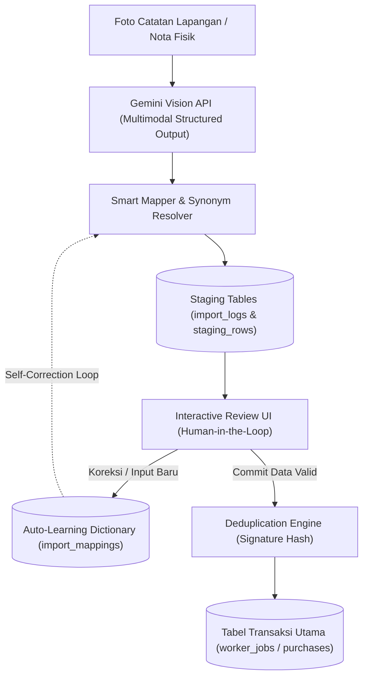
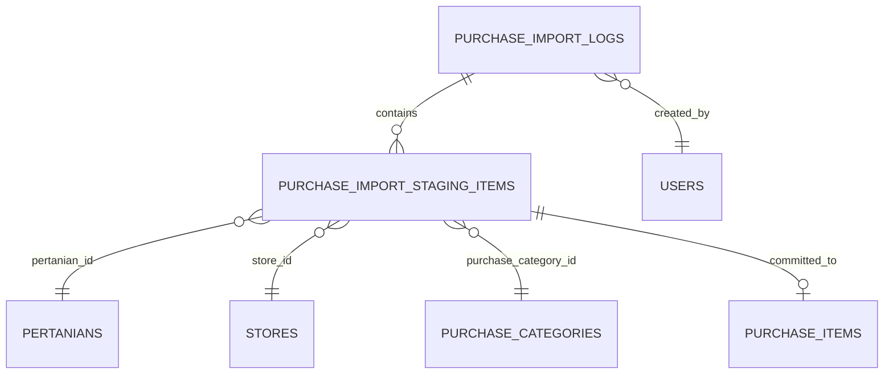

# Technical Handoff & Architecture Specification
**To:** AI System / Autonomous Agent  
**Context:** Sistem Digitalisasi Agrikultur — [Pengentani.my.id](https://pengentani.my.id)  
**Modules:**  
1. `Worker Jobs AI Vision Reader` (`/console/worker-jobs`) — *Status: Production Ready*
2. `Purchases AI Receipt Reader Blueprint` (`/console/purchases`) — *Status: Future Roadmap Specification*

---

## 1. System High-Level Architecture

Sistem mengadopsi pola **Human-in-the-Loop (HITL) Staging Pipeline**: Data tulisan tangan atau nota fisik diekstraksi menggunakan Multimodal LLM (Google Gemini Vision), dinormalisasi ke tabel *staging intermediate*, diverifikasi dan disesuaikan oleh pengguna melalui UI peninjauan interaktif dengan kemampuan *auto-learning*, lalu di-*commit* secara transaksional ke tabel operasional utama dengan pencegahan duplikasi data 100% identik.



---

## 2. Modul 1: Worker Jobs AI Vision Reader (`/console/worker-jobs`)

### 2.1 Alur Kerja Operasional (Production Workflow)
1. **Ingestion**: Pengguna mengunggah foto buku catatan kerja harian buruh tani (`JPG`/`PNG`/`WEBP`) atau menempelkan JSON manual hasil prompt mandiri.
2. **AI Vision Extraction**: `GeminiVisionService` mengirim payload gambar ke Google Gemini REST API (`gemini-2.0-flash` atau fallback `gemini-1.5-flash`). Prompt dioptimasi khusus untuk catatan pertanian Indonesia:
   - Resolusi tanda petik pengulangan (*ditto marks* `"` atau `""`).
   - Pemisahan shift kerja pagi (`PG`) dan sore (`SORE`) pada tanggal yang sama menjadi 2 transaksi terpisah.
   - Pengabaian baris bertuliskan `0` atau `Libur`.
   - Pembersihan nominal upah (`35.000` $\rightarrow$ `35000`) dan konsumsi.
   - Pemberian flag `confidence_rendah: true` jika tulisan ambigu atau rusak.
3. **Smart Entity Resolution**: `JobImportService` mencocokkan singkatan lokal (misal `SPL`, `M.Jum`, `Ngocor`) ke ID database `pertanians`, `users` (pekerja), dan `job_categories`.
4. **Staging Storage**: Hasil disimpan ke `import_logs` dan `import_staging_rows` dengan status `waiting_review`.
5. **Interactive Review UI & Auto-Learning**:
   - Jika pengguna memilih dropdown Lahan/Kebun untuk kode `SPL` (misal: *Cabai Apr 26-Mar 27*), sistem secara *real-time* menerapkan nilai tersebut ke seluruh baris lain dengan kode yang sama (*Smart Cascade*) dan menyimpannya ke tabel `import_mappings` (*Auto-Learning*).
   - Fitur *Quick Add*: Mendaftarkan pekerja atau kategori baru langsung dari modal layar review tanpa berpindah halaman.
6. **Deduplication & Transactional Commit**:
   - Baris yang sama persis dengan yang sudah ada di database diberi badge peringatan dan di-*uncheck* secara default.
   - Saat commit ditekan, data disimpan dalam `DB::transaction()` ke tabel `worker_jobs`.
   - Fitur modal review duplikat (`#modalReviewDuplicates`) memungkinkan peninjauan dan penghapusan salinan duplikat tanpa risiko menghapus data asli pertama.

---

### 2.2 Spesifikasi Skema Database (Modul Pekerja)

#### A. Tabel: `import_logs`
Menyimpan *header batch* dan metadata sesi impor data.
```sql
CREATE TABLE `import_logs` (
  `id` BIGINT UNSIGNED AUTO_INCREMENT PRIMARY KEY,
  `file_path` VARCHAR(255) NULL COMMENT 'Lokasi file gambar tersimpan di disk',
  `file_name` VARCHAR(255) NULL COMMENT 'Nama file asli saat diunggah',
  `file_hash` VARCHAR(255) NULL INDEX COMMENT 'SHA-256 hash untuk mencegah upload foto berulang',
  `source_channel` VARCHAR(50) NOT NULL DEFAULT 'photo' COMMENT 'photo | json_manual',
  `detected_worker_name` VARCHAR(255) NULL COMMENT 'Nama pekerja yang terdeteksi dari header catatan',
  `period_summary` VARCHAR(255) NULL COMMENT 'Ringkasan rentang tanggal catatan (misal: 12-25 Agustus 2026)',
  `status` VARCHAR(50) NOT NULL DEFAULT 'draft' COMMENT 'draft | processing | waiting_review | completed | failed',
  `total_rows` INT NOT NULL DEFAULT 0 COMMENT 'Jumlah baris transaksi hasil ekstraksi',
  `total_wage` DECIMAL(15,2) NOT NULL DEFAULT 0.00 COMMENT 'Total akumulasi upah dalam sesi',
  `total_konsumsi` DECIMAL(15,2) NOT NULL DEFAULT 0.00 COMMENT 'Total akumulasi uang konsumsi dalam sesi',
  `error_message` TEXT NULL COMMENT 'Log pesan error jika ekstraksi AI gagal',
  `raw_json` LONGTEXT NULL COMMENT 'Raw JSON response dari Google Gemini API',
  `created_by` BIGINT UNSIGNED NULL,
  `created_at` TIMESTAMP NULL,
  `updated_at` TIMESTAMP NULL,
  FOREIGN KEY (`created_by`) REFERENCES `users`(`id`) ON DELETE SET NULL
) ENGINE=InnoDB DEFAULT CHARSET=utf8mb4 COLLATE=utf8mb4_unicode_ci;
```

#### B. Tabel: `import_staging_rows`
Area penampungan sementara (*staging buffer*) sebelum data dipindahkan ke tabel operasional.
```sql
CREATE TABLE `import_staging_rows` (
  `id` BIGINT UNSIGNED AUTO_INCREMENT PRIMARY KEY,
  `import_log_id` BIGINT UNSIGNED NOT NULL,
  `date` DATE NOT NULL COMMENT 'Tanggal transaksi pekerjaan hasil normalisasi (YYYY-MM-DD)',
  `raw_date_text` VARCHAR(255) NULL COMMENT 'Teks tanggal mentah dari tulisan tangan (misal: 22/8/..)',
  `pertanian_id` BIGINT UNSIGNED NULL COMMENT 'Foreign key ke tabel pertanians hasil smart resolution',
  `raw_kebun_code` VARCHAR(255) NULL COMMENT 'Kode/nama kebun mentah dari catatan (misal: SPL, JJ6)',
  `worker_id` BIGINT UNSIGNED NULL COMMENT 'Foreign key ke tabel users (role=pekerja)',
  `raw_worker_name` VARCHAR(255) NULL COMMENT 'Nama pekerja mentah dari catatan',
  `job_category_id` BIGINT UNSIGNED NULL COMMENT 'Foreign key ke tabel job_categories',
  `raw_job_name` VARCHAR(255) NULL COMMENT 'Teks pekerjaan mentah (misal: Ngocor air, M.Jum, Obat)',
  `description` TEXT NULL COMMENT 'Keterangan tambahan atau rincian shift (misal: Pagi / Sore)',
  `wage` DECIMAL(15,2) NOT NULL DEFAULT 0.00 COMMENT 'Nominal upah kerja',
  `konsumsi` DECIMAL(15,2) NOT NULL DEFAULT 0.00 COMMENT 'Nominal uang makan / konsumsi',
  `status` VARCHAR(50) NOT NULL DEFAULT 'unpaid' COMMENT 'Status pembayaran: paid | unpaid',
  `confidence_rendah` TINYINT(1) NOT NULL DEFAULT 0 COMMENT '1 jika AI menandai tulisan buram/ambigu',
  `status_baris` VARCHAR(50) NOT NULL DEFAULT 'ok' COMMENT 'ok | perlu_review',
  `review_notes` TEXT NULL COMMENT 'Catatan error/peringatan validasi untuk user',
  `disertakan` TINYINT(1) NOT NULL DEFAULT 1 COMMENT '1 = dicentang untuk di-commit, 0 = dilewati/duplikat',
  `created_worker_job_id` BIGINT UNSIGNED NULL COMMENT 'ID baris worker_jobs setelah di-commit',
  `created_at` TIMESTAMP NULL,
  `updated_at` TIMESTAMP NULL,
  FOREIGN KEY (`import_log_id`) REFERENCES `import_logs`(`id`) ON DELETE CASCADE,
  FOREIGN KEY (`pertanian_id`) REFERENCES `pertanians`(`id`) ON DELETE SET NULL,
  FOREIGN KEY (`worker_id`) REFERENCES `users`(`id`) ON DELETE SET NULL,
  FOREIGN KEY (`job_category_id`) REFERENCES `job_categories`(`id`) ON DELETE SET NULL,
  FOREIGN KEY (`created_worker_job_id`) REFERENCES `worker_jobs`(`id`) ON DELETE SET NULL
) ENGINE=InnoDB DEFAULT CHARSET=utf8mb4 COLLATE=utf8mb4_unicode_ci;
```

#### C. Tabel: `import_mappings`
Kamus pintar asosiasi istilah lokal terhadap master data ID (*Self-learning synonym repository*).
```sql
CREATE TABLE `import_mappings` (
  `id` BIGINT UNSIGNED AUTO_INCREMENT PRIMARY KEY,
  `type` VARCHAR(50) NOT NULL COMMENT 'Tipe entitas: pertanian | pekerja | kategori',
  `raw_label` VARCHAR(255) NOT NULL INDEX COMMENT 'Istilah atau singkatan mentah lokal (misal: SPL, NGOCOR)',
  `target_id` BIGINT UNSIGNED NOT NULL COMMENT 'ID target pada tabel referensi master',
  `target_name` VARCHAR(255) NULL COMMENT 'Nama display target untuk cache visualisasi',
  `created_at` TIMESTAMP NULL,
  `updated_at` TIMESTAMP NULL,
  UNIQUE KEY `import_mappings_type_raw_label_unique` (`type`, `raw_label`)
) ENGINE=InnoDB DEFAULT CHARSET=utf8mb4 COLLATE=utf8mb4_unicode_ci;
```

#### D. Tabel Target: `worker_jobs`
Tabel operasional transaksi upah dan catatan kerja harian.
```sql
CREATE TABLE `worker_jobs` (
  `id` BIGINT UNSIGNED AUTO_INCREMENT PRIMARY KEY,
  `pertanian_id` BIGINT UNSIGNED NOT NULL,
  `worker_id` BIGINT UNSIGNED NOT NULL,
  `job_category_id` BIGINT UNSIGNED NOT NULL,
  `date` DATE NOT NULL,
  `start_time` TIME NULL,
  `end_time` TIME NULL,
  `wage` DECIMAL(15,2) NOT NULL DEFAULT 0.00,
  `konsumsi` DECIMAL(15,2) NOT NULL DEFAULT 0.00,
  `description` TEXT NULL,
  `status` VARCHAR(50) NOT NULL DEFAULT 'unpaid' COMMENT 'unpaid | paid',
  `created_at` TIMESTAMP NULL,
  `updated_at` TIMESTAMP NULL,
  FOREIGN KEY (`pertanian_id`) REFERENCES `pertanians`(`id`) ON DELETE CASCADE,
  FOREIGN KEY (`worker_id`) REFERENCES `users`(`id`) ON DELETE CASCADE,
  FOREIGN KEY (`job_category_id`) REFERENCES `job_categories`(`id`) ON DELETE CASCADE
) ENGINE=InnoDB DEFAULT CHARSET=utf8mb4 COLLATE=utf8mb4_unicode_ci;
```

---

### 2.3 Kontrak Output AI Vision (JSON Data Contract)

Prompt Gemini AI Vision menghasilkan format JSON strictly-typed berikut:
```json
{
  "nama_pekerja_header": "Kusnul",
  "periode_catatan": "Agustus 2026",
  "catatan_tambahan": "Terdapat beberapa tanda petik pengulangan di kolom pekerjaan",
  "baris_pekerjaan": [
    {
      "tanggal": "2026-08-12",
      "tanggal_asli": "12/8",
      "lahan_raw": "SPL",
      "pekerja_raw": "Kusnul",
      "pekerjaan_raw": "Ngocor air",
      "deskripsi": "Shift Pagi",
      "upah": 35000,
      "konsumsi": 10000,
      "jam_mulai": "07:00",
      "jam_selesai": "11:00",
      "confidence_rendah": false
    }
  ]
}
```

---

### 2.4 Algoritma Deteksi Duplikasi (Exact Match Deduplication)

Untuk mencegah data ganda akibat reload, scan ulang, atau entri berulang:
1. **Signature Generation (`WorkerJob@getDuplicateSignature`)**:
   $$\text{Signature} = \text{MD5}\big(\text{pertanian\_id} \parallel \text{worker\_id} \parallel \text{job\_category\_id} \parallel \text{date} \parallel \text{wage} \parallel \text{konsumsi} \parallel \text{description} \parallel \text{start\_time} \parallel \text{end\_time}\big)$$
2. **Review Modal Protection**:
   - Jika terdeteksi duplikasi, baris yang lebih awal dipertahankan (`Data Asli`), dan salinan berikutnya (`Salinan Duplikat`) ditampilkan dalam tabel preview modal.
   - Penghapusan hanya mengeksekusi subset ID salinan yang diverifikasi oleh `array_intersect` di sisi backend; data asli dijamin tidak akan pernah terhapus.

---

## 3. Modul 2: Purchases AI Receipt / Nota Reader (`/console/purchases`) — Blueprint Pengembangan Kedepan

Modul `/console/purchases` saat ini mengelola pencatatan pengeluaran modal tani (pembelian benih, pupuk, pestisida, peralatan) melalui tabel spreadsheet spreadsheet-ce.

### 3.1 Struktur Relasi Data Eksisting Modul Purchases
- **Header**: Tabel `purchases` (`id`, `pertanian_id`, `store_id`, `invoice_number`, `date`, `total_amount`).
- **Line Items**: Tabel `purchase_items` (`id`, `purchase_id`, `purchase_category_id`, `category`, `description`, `qty`, `unit_price`, `total_price`, `transaction_proof_id`).
- **Master Referensi**:
  - `stores` (`id`, `name`, `address`, `phone`).
  - `purchase_categories` (`id`, `name`, `description`).
  - `pertanians` (`id`, `kebun_id`, `name`, `user_id`).
  - `transaction_proofs` (`id`, `user_id`, `name`, `file_path`, `file_type`).

---

### 3.2 Desain Skema Database Baru (Staging & Mapping untuk Modul Purchases)

Untuk menerapkan AI scanner foto nota belanja / kuitansi toko tani, buat migration baru dengan 3 tabel berikut:



#### A. Tabel Baru: `purchase_import_logs`
Menyimpan metadata file nota/struk belanja, hasil ekstraksi header toko, total belanja, dan status sesi.
```sql
CREATE TABLE `purchase_import_logs` (
  `id` BIGINT UNSIGNED AUTO_INCREMENT PRIMARY KEY,
  `file_path` VARCHAR(255) NOT NULL COMMENT 'Path file foto struk/nota tersimpan',
  `file_name` VARCHAR(255) NOT NULL COMMENT 'Nama file asli',
  `file_hash` VARCHAR(255) NOT NULL INDEX COMMENT 'SHA-256 hash nota untuk mencegah scan nota ganda',
  `source_channel` VARCHAR(50) NOT NULL DEFAULT 'photo' COMMENT 'photo | pdf | json_manual',
  `detected_store_name` VARCHAR(255) NULL COMMENT 'Nama toko yang tertera di header nota',
  `detected_invoice_number` VARCHAR(100) NULL COMMENT 'Nomor nota/faktur/kuitansi',
  `detected_date` DATE NULL COMMENT 'Tanggal transaksi pada nota',
  `detected_total_amount` DECIMAL(20,2) NOT NULL DEFAULT 0.00 COMMENT 'Grand total yang tertera di fisik nota',
  `status` VARCHAR(50) NOT NULL DEFAULT 'draft' COMMENT 'draft | processing | waiting_review | completed | failed',
  `total_items` INT NOT NULL DEFAULT 0 COMMENT 'Jumlah item barang yang terdeteksi',
  `items_subtotal` DECIMAL(20,2) NOT NULL DEFAULT 0.00 COMMENT 'Hasil kalkulasi akumulasi qty * unit_price',
  `discrepancy_amount` DECIMAL(20,2) NOT NULL DEFAULT 0.00 COMMENT 'Selisih antara total nota vs akumulasi item (diskon/ongkir/pajak)',
  `error_message` TEXT NULL,
  `raw_json` LONGTEXT NULL COMMENT 'Full JSON response dari Gemini Vision',
  `transaction_proof_id` BIGINT UNSIGNED NULL COMMENT 'Relasi ke transaction_proofs jika foto dijadikan bukti sah',
  `created_by` BIGINT UNSIGNED NOT NULL,
  `created_at` TIMESTAMP NULL,
  `updated_at` TIMESTAMP NULL,
  FOREIGN KEY (`created_by`) REFERENCES `users`(`id`) ON DELETE CASCADE,
  FOREIGN KEY (`transaction_proof_id`) REFERENCES `transaction_proofs`(`id`) ON DELETE SET NULL
) ENGINE=InnoDB DEFAULT CHARSET=utf8mb4 COLLATE=utf8mb4_unicode_ci;
```

#### B. Tabel Baru: `purchase_import_staging_items`
Area penampungan per baris item barang belanja sebelum digabungkan ke satu nota `purchases` dan `purchase_items`.
```sql
CREATE TABLE `purchase_import_staging_items` (
  `id` BIGINT UNSIGNED AUTO_INCREMENT PRIMARY KEY,
  `purchase_import_log_id` BIGINT UNSIGNED NOT NULL,
  `item_order` INT NOT NULL DEFAULT 1 COMMENT 'Urutan nomor baris dalam nota',
  `date` DATE NOT NULL COMMENT 'Tanggal belanja',
  `pertanian_id` BIGINT UNSIGNED NULL COMMENT 'Target kebun/pertanian yang dibebani biaya',
  `raw_pertanian_text` VARCHAR(255) NULL,
  `store_id` BIGINT UNSIGNED NULL COMMENT 'ID Toko hasil smart match',
  `raw_store_name` VARCHAR(255) NULL COMMENT 'Nama toko mentah dari nota',
  `invoice_number` VARCHAR(100) NULL COMMENT 'Nomor nota belanja',
  `purchase_category_id` BIGINT UNSIGNED NULL COMMENT 'ID kategori barang (Bibit, Pupuk, Pestisida, Peralatan)',
  `raw_category_name` VARCHAR(255) NULL COMMENT 'Teks kategori mentah atau tebakan AI',
  `item_description` VARCHAR(255) NOT NULL COMMENT 'Nama barang / produk (misal: Urea Daun Buah 50kg, Dursban 200EC)',
  `qty` DECIMAL(10,2) NOT NULL DEFAULT 1.00 COMMENT 'Kuantitas barang',
  `unit_name` VARCHAR(50) NULL COMMENT 'Satuan (sak, botol, kg, liter, bungkus, ikat)',
  `unit_price` DECIMAL(20,2) NOT NULL DEFAULT 0.00 COMMENT 'Harga satuan per unit',
  `total_price` DECIMAL(20,2) NOT NULL DEFAULT 0.00 COMMENT 'Subtotal harga barang (qty * unit_price)',
  `confidence_rendah` TINYINT(1) NOT NULL DEFAULT 0 COMMENT 'Flag jika tulisan angka harga/nama barang kabur',
  `status_baris` VARCHAR(50) NOT NULL DEFAULT 'ok' COMMENT 'ok | perlu_review',
  `review_notes` TEXT NULL COMMENT 'Peringatan selisih kalkulasi atau master data tidak ditemukan',
  `disertakan` TINYINT(1) NOT NULL DEFAULT 1 COMMENT '1 = dimasukkan ke nota, 0 = abaikan',
  `created_purchase_item_id` BIGINT UNSIGNED NULL COMMENT 'ID hasil commit ke purchase_items',
  `created_at` TIMESTAMP NULL,
  `updated_at` TIMESTAMP NULL,
  FOREIGN KEY (`purchase_import_log_id`) REFERENCES `purchase_import_logs`(`id`) ON DELETE CASCADE,
  FOREIGN KEY (`pertanian_id`) REFERENCES `pertanians`(`id`) ON DELETE SET NULL,
  FOREIGN KEY (`store_id`) REFERENCES `stores`(`id`) ON DELETE SET NULL,
  FOREIGN KEY (`purchase_category_id`) REFERENCES `purchase_categories`(`id`) ON DELETE SET NULL,
  FOREIGN KEY (`created_purchase_item_id`) REFERENCES `purchase_items`(`id`) ON DELETE SET NULL
) ENGINE=InnoDB DEFAULT CHARSET=utf8mb4 COLLATE=utf8mb4_unicode_ci;
```

#### C. Tabel Baru: `purchase_import_mappings`
Kamus auto-learning untuk nama toko tani lokal dan pengelompokan otomatis merek barang ke kategori belanja.
```sql
CREATE TABLE `purchase_import_mappings` (
  `id` BIGINT UNSIGNED AUTO_INCREMENT PRIMARY KEY,
  `type` VARCHAR(50) NOT NULL COMMENT 'store | category',
  `raw_keyword` VARCHAR(255) NOT NULL INDEX COMMENT 'Nama toko mentah atau keyword barang (misal: UD TANI JAYA, ROUNDUP, NPK PHONSKA)',
  `target_id` BIGINT UNSIGNED NOT NULL COMMENT 'store_id jika type=store, purchase_category_id jika type=category',
  `target_name` VARCHAR(255) NULL COMMENT 'Nama display referensi master',
  `created_at` TIMESTAMP NULL,
  `updated_at` TIMESTAMP NULL,
  UNIQUE KEY `purchase_mappings_type_keyword_unique` (`type`, `raw_keyword`)
) ENGINE=InnoDB DEFAULT CHARSET=utf8mb4 COLLATE=utf8mb4_unicode_ci;
```

#### D. Rekomendasi Penyesuaian Kolom pada Tabel Eksisting
Untuk mengikat integritas bukti foto struk:
1. **Tabel `purchases`**: Tambahkan kolom `purchase_import_log_id` (nullable foreign key) untuk melacak nota mana yang diimpor melalui scan AI.
2. **Tabel `purchase_items`**: Manfaatkan relasi eksisting `transaction_proof_id` yang otomatis dibuatkan record filenya saat foto nota pertama kali diunggah.

---

### 3.3 Spesifikasi Prompt & Kontrak JSON AI Vision (Nota Belanja Tani)

Prompt multimodal untuk pembacaan struk/nota belanja toko pertanian:
```json
{
  "toko": {
    "nama": "UD Tani Makmur Sejahtera",
    "alamat": "Jl. Raya Wonorejo No. 45",
    "telepon": "08123456789"
  },
  "faktur": {
    "nomor_nota": "NOTA-2026/08/004",
    "tanggal": "2026-08-15",
    "grand_total_nota": 475000,
    "diskon": 0,
    "ongkos_kirim": 0
  },
  "items": [
    {
      "urutan": 1,
      "nama_barang": "Pupuk NPK Mutiara 16-16-16",
      "kategori_tebakan": "Pupuk",
      "qty": 2.0,
      "satuan": "sak (50kg)",
      "harga_satuan": 175000,
      "total_harga": 350000,
      "confidence_rendah": false
    },
    {
      "urutan": 2,
      "nama_barang": "Insektisida Alika 100ml",
      "kategori_tebakan": "Pestisida",
      "qty": 2.0,
      "satuan": "botol",
      "harga_satuan": 62500,
      "total_harga": 125000,
      "confidence_rendah": false
    }
  ],
  "catatan_ocr": "Struk manual stempel basah, kondisi angka jelas"
}
```

---

### 3.4 Validasi Keuangan & Integritas Data (Financial Reconciliation Engine)

Sebelum nota di-*commit* ke tabel `purchases` dan `purchase_items`:
1. **Reconciliation Check**:
   $$\text{Items Subtotal} = \sum (\text{qty} \times \text{unit\_price})$$
   $$\text{Discrepancy} = \text{detected\_total\_amount} - \text{Items Subtotal}$$
   Jika $\text{Discrepancy} \neq 0$, UI review memberikan highlight peringatan agar pengguna memeriksa diskon, pembulatan, atau kesalahan pembacaan angka.
2. **Header Grouping Logic**:
   Sesuai logika `PurchaseController`, beberapa barang belanjaan dalam 1 struk akan otomatis digabung ke dalam 1 record tabel `purchases` jika memiliki kecocokan pada:
   `[pertanian_id, store_id, date, invoice_number]`.
3. **Pencegahan Nota Ganda (Duplicate Receipt Check)**:
   Nota dianggap duplikat jika:
   - Hash file gambar sama persis dengan yang tersimpan di `purchase_import_logs.file_hash`.
   - ATAU sudah ada transaksi pada `purchases` dengan kombinasi `store_id` + `date` + `invoice_number` + `total_amount` yang identik.

---

### 3.5 Rencana Endpoint & Controller (Implementation Checklist)

Untuk agen AI berikutnya yang mengeksekusi modul Purchases AI:

| Method | Endpoint URI | Fungsi Controller |
| :--- | :--- | :--- |
| `GET` | `/console/purchases/import` | Menampilkan daftar riwayat scan nota pembelian |
| `GET` | `/console/purchases/import/create` | Form upload foto nota / struk belanja |
| `POST` | `/console/purchases/import/photo` | Kirim gambar ke `GeminiVisionService` $\rightarrow$ simpan staging $\rightarrow$ redirect ke review |
| `GET` | `/console/purchases/import/{id}/review` | Layar review interaktif data nota belanja (HITL) |
| `POST` | `/console/purchases/import/{id}/commit` | Commit transaksional ke tabel `purchases` & `purchase_items` |
| `POST` | `/console/purchases/import/save-mapping` | Endpoint auto-learning untuk toko dan kategori baru |
| `DELETE` | `/console/purchases/import/{id}` | Hapus sesi import draft |

---

## 4. Kesimpulan & Panduan Integrasi (Agent Handoff)

1. **Modul Pekerja (`worker_jobs`)**: Seluruh backend, integrasi Gemini API, sistem auto-learning cascade, mitigasi reload, dan modal review selektif duplikasi telah aktif di production, teruji aman, dan tercatat pada git branch `main`.
2. **Modul Pembelian (`purchases`)**: Skema DDL tabel `purchase_import_logs`, `purchase_import_staging_items`, dan `purchase_import_mappings` yang dirancang di atas mengikuti konvensi arsitektur yang sama persis sehingga dapat langsung dibuatkan migration file Laravel dan menggunakan ulang komponen UI review Metronic 8 yang sudah ada.
